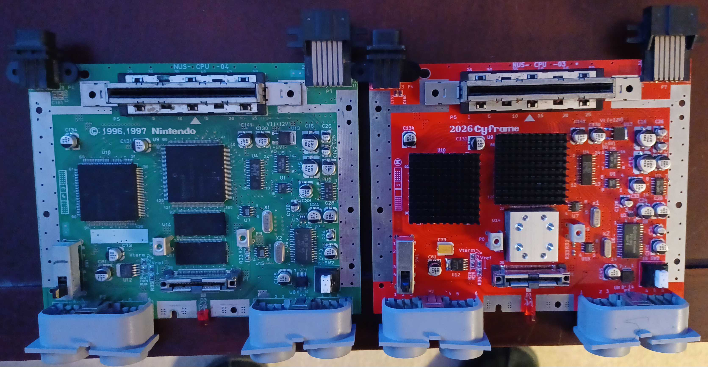
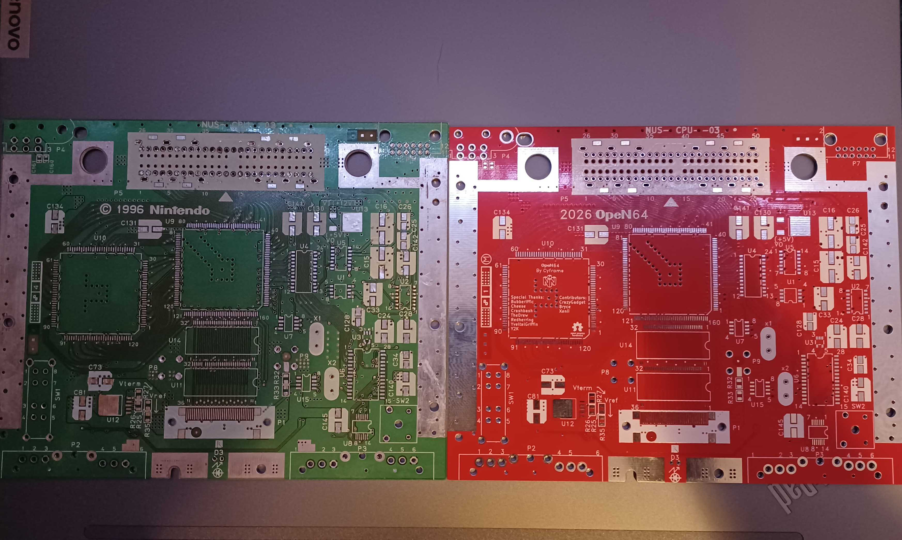
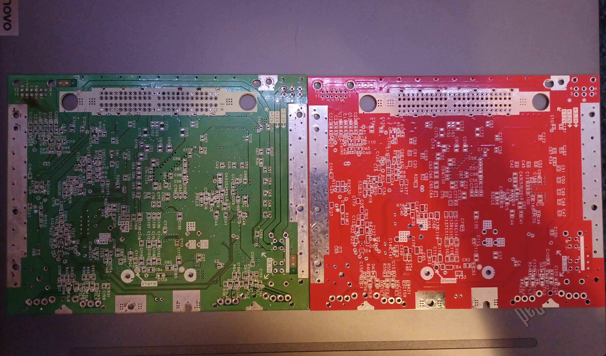
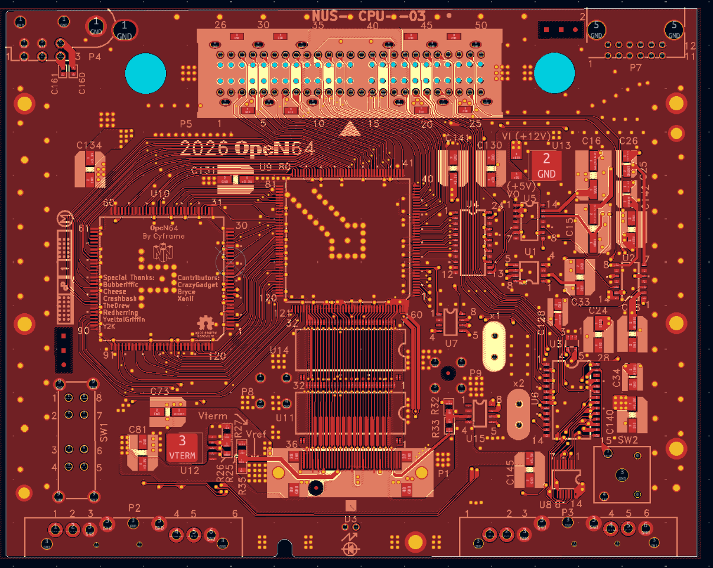
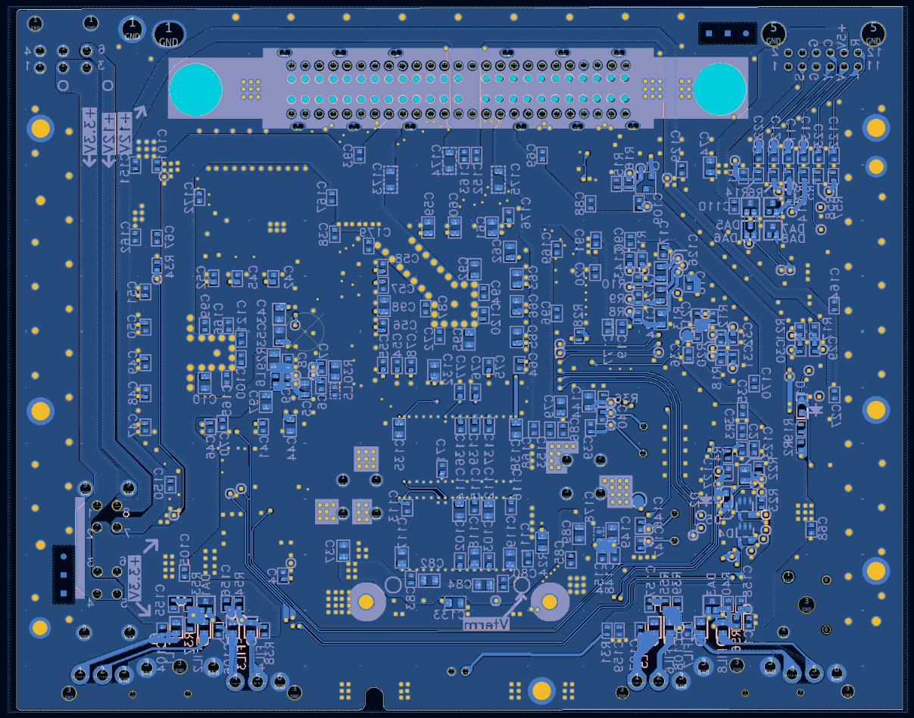
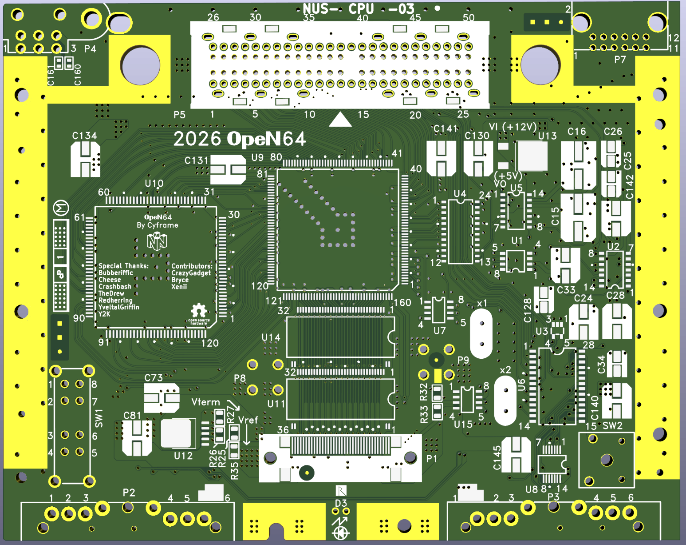
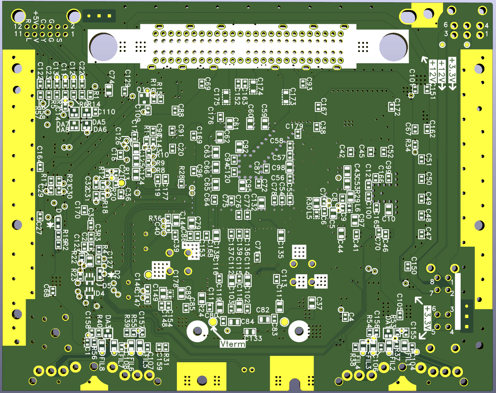
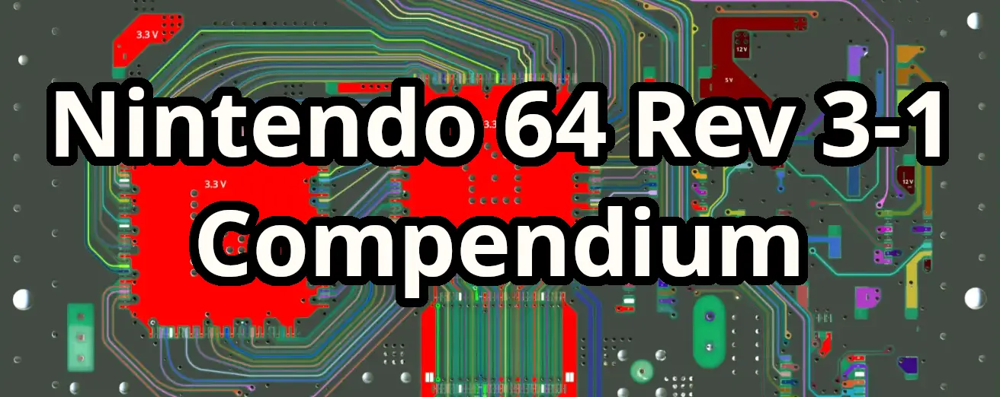

# OpeN64

OpeN64 is an open-source recreation of the N64 motherboard made in KiCAD.  This project currently only supports rev 03 of the N64 motherboard, but support for more revisions may be added in the future if demand exists.

## Features

- Recreated N64 motherboard layout in KiCAD
- Designed for preservation, research, hardware mods, and accessibility
- Made to support original Nintendo 64 hardware
- Includes a compendium documenting every electrical connection made by the motherboard made in GIMP

## Goals

- Preserve legacy hardware design knowledge
- Enable and inspire repair and modification of N64 hardware 
- Provide fully open hardware reference design and extensive documentation to interested parties

## Gallery

## Assembly

Since OpeN64 uses original N64 hardware, the only items needed for assembly are an unpopulated OpeN64 board, and an 03 revision of the Nintendo 64 motherboard.  Other motherboard revisions may work, but none other than rev 03 have been tested, so use as your own risk!

## Compendium

Part of the OpeN64 project is a compendium - that is: a clear visual documentation of the N64 motherboard.

[The Compendium can be found on the BitBuilt forums here ](https://bitbuilt.net/forums/threads/n64-rev-3-1-compendium.7053/)

## Credits
Contributors:
CrazyGadget - Provided the primary board scans used for the compendium
Xenii - Made adjustments to footprints
Bryce - Provided additional board scans for reference

Special Thanks:
Bubberiffic
Cheese
CrashBash
TheDrew
Redherring
YveltalGriffin
Y2K

## License

This project is licensed under the CERN-OHL-P v2.

You may redistribute and modify this design and manufacture products using it
under the terms of the CERN-OHL-P v2:
https://cern.ch/cern-ohl

This documentation is distributed WITHOUT ANY EXPRESS OR IMPLIED WARRANTY,
INCLUDING OF MERCHANTABILITY, SATISFACTORY QUALITY AND FITNESS FOR A
PARTICULAR PURPOSE. Please see the CERN-OHL-P v2 for applicable conditions.

## Disclaimer

This project is an independent, community-created hardware reimplementation
and is not affiliated with, endorsed by, or associated with Nintendo.

All trademarks are the property of their respective owners.